# GuardDutySync

Python automation pipeline that polls AWS GuardDuty findings, enriches each finding with MITRE ATT&CK context, and auto-creates triage tickets in Jira Cloud.

## Summary

Built GuardDutySync, a Python automation pipeline that polls AWS GuardDuty findings via the GuardDuty API, maps each finding type to MITRE ATT&CK tactics and techniques using a custom-built technique mapping table and the STIX bundle, and auto-creates structured triage tickets in Jira Cloud via REST API with severity-mapped priority and MITRE enrichment fields; includes local-state deduplication to prevent duplicate tickets across pipeline runs.

## Architecture

The pipeline runs in three stages.

```
GuardDuty API -> poller.py -> enricher.py -> ticketer.py -> Jira Cloud
```

**Stage 1: Poller.** Authenticates via IAM access key and boto3, then calls the GuardDuty API to fetch findings.

**Stage 2: Enricher.** Maps each finding type to a MITRE ATT&CK technique ID using a custom mapping table, then looks up the full technique name, tactic, and description from the MITRE ATT&CK STIX bundle (`enterprise-attack.json`, downloaded separately).

**Stage 3: Ticketer.** Posts a structured Jira issue via REST API with all enriched fields, severity mapped from the GuardDuty 0 to 10 float scale to Jira High/Medium/Low priority. Findings already recorded in `processed_findings.json` are skipped to prevent duplicates.

## Tech Stack

| Component | Implementation |
| --- | --- |
| Alert source | AWS GuardDuty via boto3 |
| Auth | IAM user with AmazonGuardDutyReadOnlyAccess, access key loaded from `.env` |
| Enrichment | MITRE ATT&CK STIX bundle (`enterprise-attack.json`) plus custom finding type to technique mapping table |
| Ticketing | Jira Cloud REST API (free tier) |
| Language | Python 3.13 |
| Scheduling | Designed for GitHub Actions cron (every 15 minutes) or local cron; cron workflow not included in this repo |
| Secrets | `.env` file locally (see `.env.example`) |

## Setup

1. Clone the repo.

```bash
git clone https://github.com/ronankongala/guardduty-sync.git
cd guardduty-sync
```

2. Install dependencies.

```bash
pip install -r requirements.txt
```

3. Download `enterprise-attack.json`.

```bash
python -c "import requests; r = requests.get('https://raw.githubusercontent.com/mitre/cti/master/enterprise-attack/enterprise-attack.json'); open('enterprise-attack.json', 'wb').write(r.content)"
```

4. Copy `.env.example` to `.env` and fill in all values.

```bash
cp .env.example .env
```

5. Run the pipeline.

```bash
python main.py
```

## Screenshots

**IAM user with AmazonGuardDutyReadOnlyAccess policy attached**

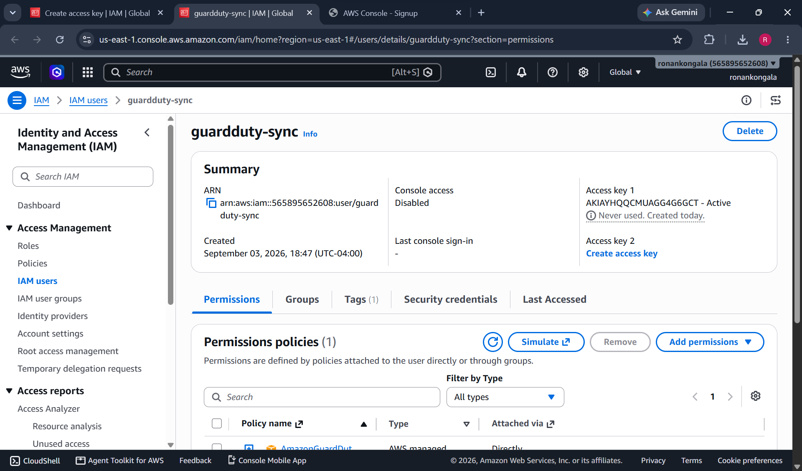

**GuardDuty enabled and active in us-east-1**

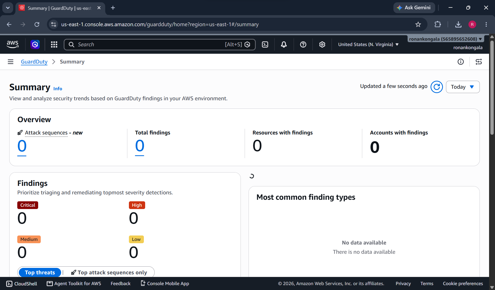

**434 sample findings generated across all GuardDuty finding types**

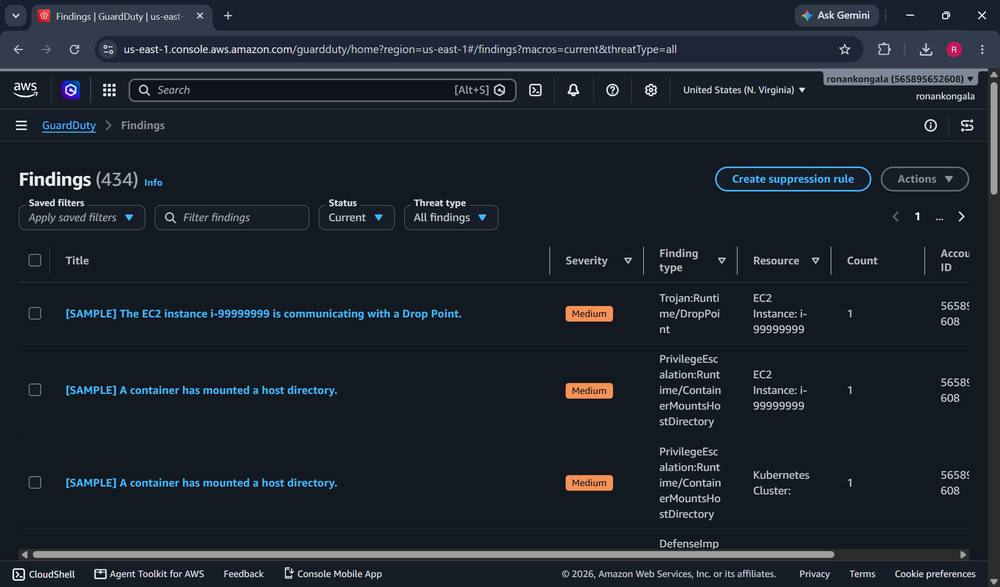

**Successful boto3 auth returning the GuardDuty detector ID**

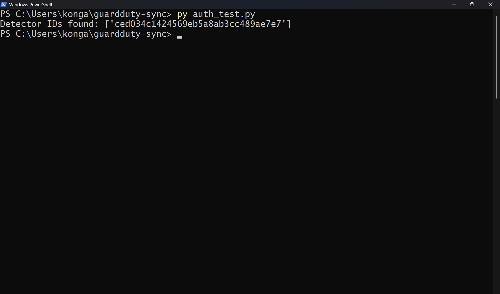

**poller.py fetching 25 findings with ID, title, and severity logged per finding**

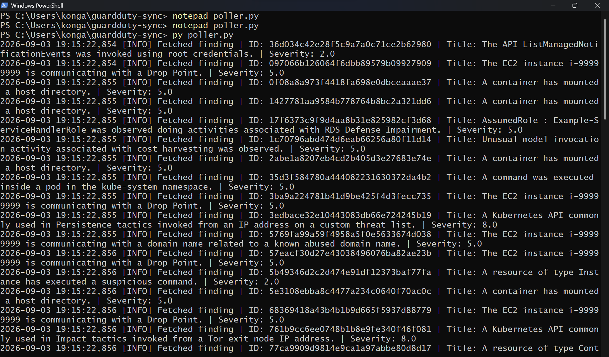

**enricher.py resolving finding types to MITRE techniques and tactics**

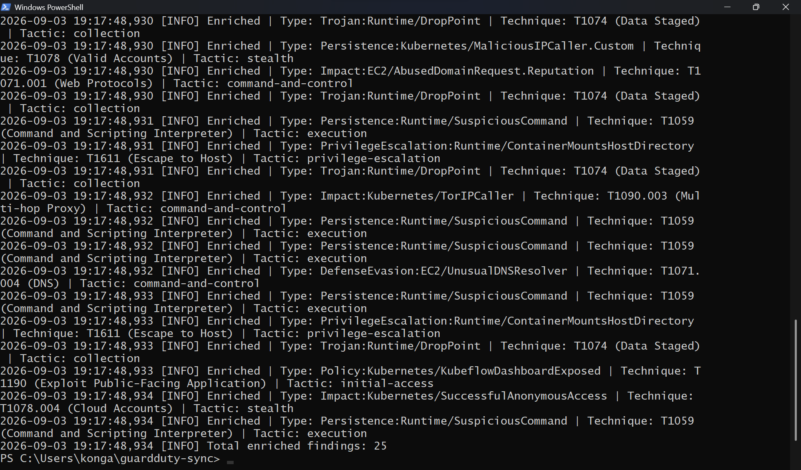

**T1074 Data Staged verified against attack.mitre.org**

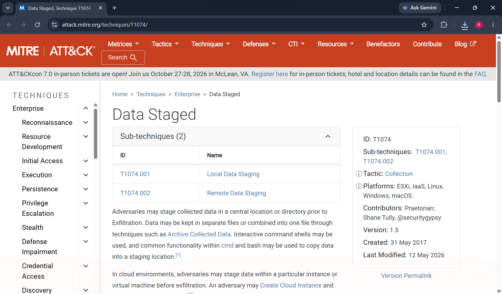

**Jira Cloud project created for triage tickets**

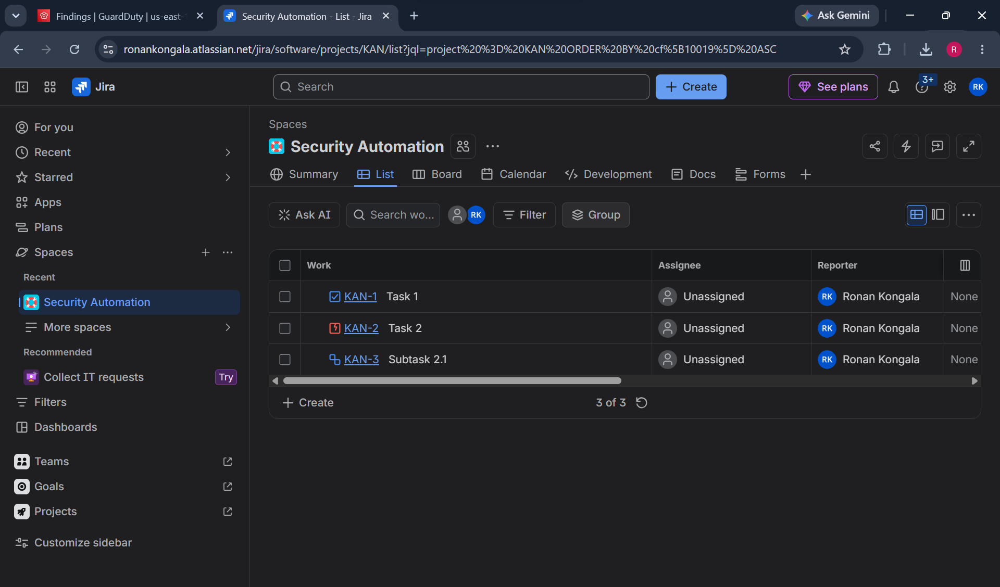

**Test issue created via Jira REST API confirming auth works**

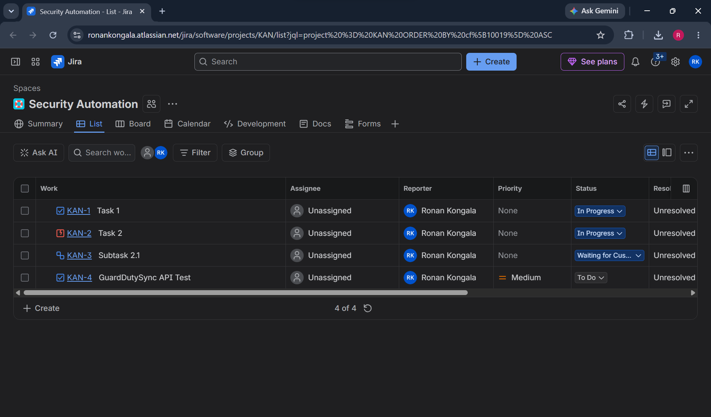

**ticketer.py creating 5 Jira tickets with priority mapping logged**

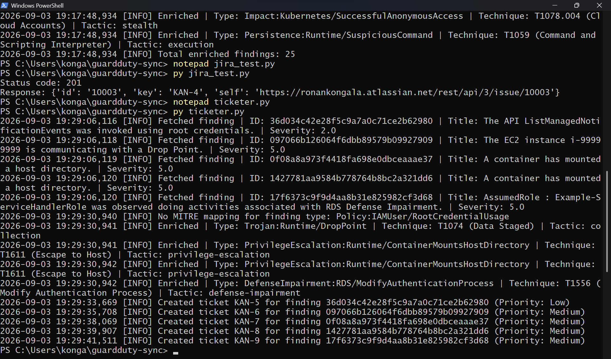

**Fully populated Jira ticket showing all enriched fields**

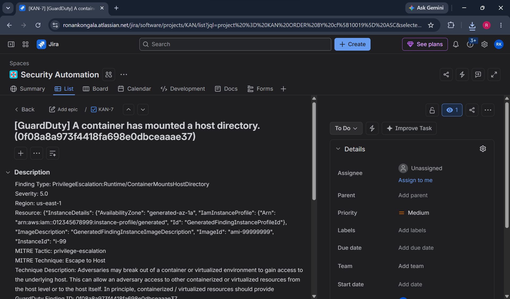

**Full pipeline run, 10 alerts fetched, 10 tickets created, 0 errors**

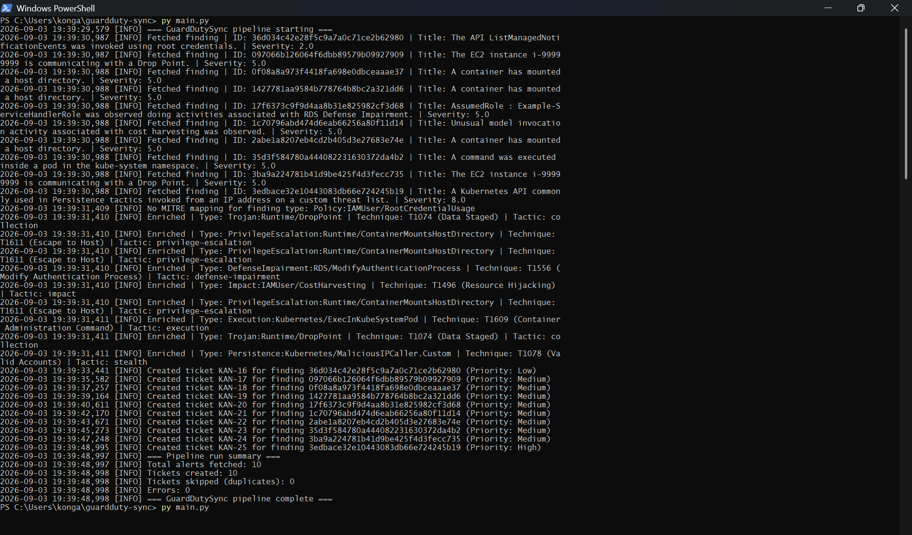

**Second pipeline run, 10 findings skipped as duplicates, 0 tickets created**

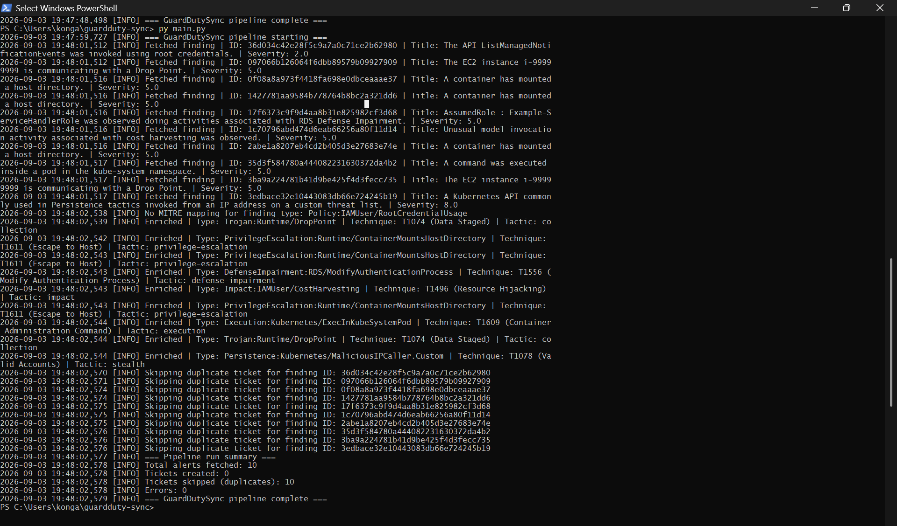

**Jira ticket showing High priority correctly set from GuardDuty severity 8.0 after the priority mapping fix**

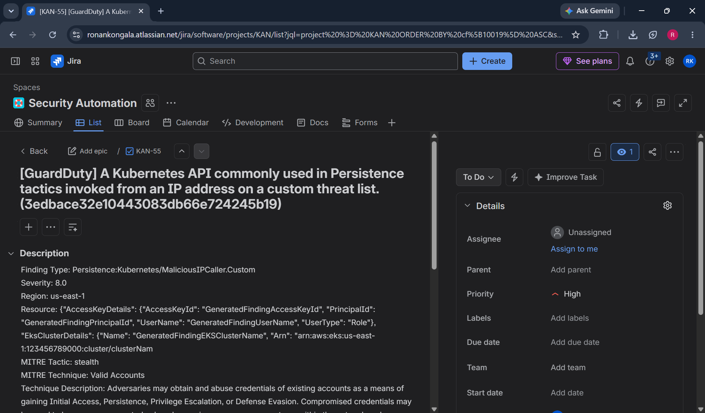

## Notes

- `enterprise-attack.json` is not in this repo (48MB). Download it using the command in Setup.
- The pipeline uses local state (`processed_findings.json`) for deduplication across runs.
- Jira API tokens expire. Renew the token in `.env` before it lapses to keep the pipeline running.
- Authorization: all API calls are to your own AWS account and Jira tenant. No external systems are targeted.

## License

Released under the MIT License. See [LICENSE](LICENSE).
